[![Issues][issues-shield]][issues-url]

<!-- 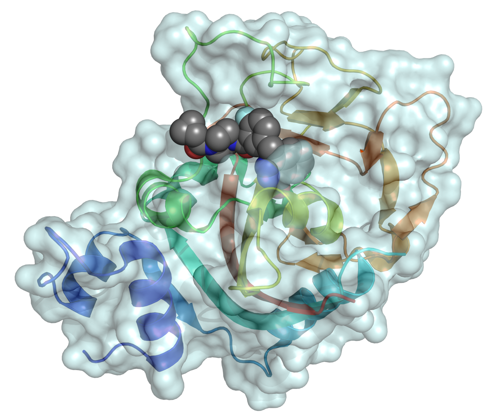 -->
<!-- 

<em>Image Source: Protein Data Bank | 5DS3</em>

 --> 
<!-- 
<em>Image Source: Protein Data Bank | 5DS3</em>
 -->

<h1 align="center">Integrative Analysis of HRD and PARPi Drug Response</h1>
<!-- <h1 align="center">HRD Profiling & PARP Inhibitor Response</h1> -->
<h4 align="center">A functional genomics framework for classifying homologous recombination deficiency  and mapping PARP inhibitor sensitivity across DepMap cancer cell lines.</h4>
  

     
    <a href="https://github.com/rc-9/DepMap_HRD_PARPi/issues">Report Bug</a>
    ·
    <a href="https://github.com/rc-9/DepMap_HRD_PARPi/issues">Request Feature</a>
  

<!-- TABLE OF CONTENTS -->

  
Table of Contents

  <ol>
    <li><a href="#background">Background</a></li>
    <li><a href="#research-question">Research Question</a></li>
    <li><a href="#methodology">Methodology</a></li>
    <li><a href="#key-findings">Key Findings</a></li>
    <li><a href="#conclusions">Conclusions</a></li>
  </ol>

# Project Walkthrough

## 1. Background

Cancer arises from the accumulation of genetic and epigenetic alterations that disrupt normal cellular growth and DNA repair mechanisms. A central mechanism for maintaining genomic integrity is homologous recombination (**HR**), a high-fidelity pathway that repairs DNA double-strand breaks using an intact sister chromatid as a template. Deficiencies in this process, collectively termed as homologous recombination deficiency (**HRD**), can result from mutations in key genes such as BRCA1/2, epigenetic silencing, or other genomic alterations, ultimately leading to genomic instability.

HRD is clinically significant because it creates therapeutically exploitable vulnerabilities. Poly (ADP-ribose) polymerase (**PARP**) is an enzyme that facilitates repair of single-strand DNA lesions. If these lesions persist into DNA replication, replication fork collapse can generate double-strand breaks. In HRD cells, these breaks cannot be accurately repaired. Therefore, pharmacologic inhibition of PARP induces **synthetic lethality**: the combined loss of HR function and PARP-mediated repair overwhelms DNA repair capacity, leading to accumulation of DNA damage and selective cancer cell death.

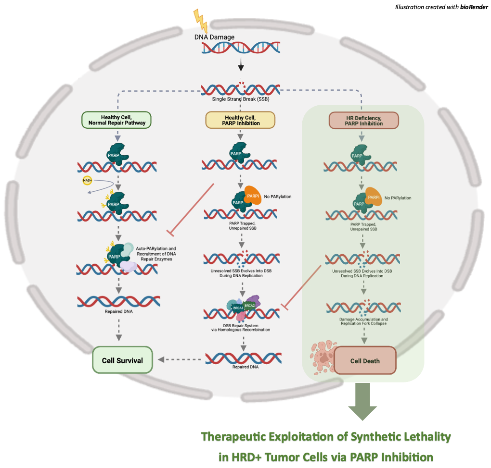

On this basis, PARP inhibitors (PARPi) are approved across multiple malignancies enriched for HRD, particularly those harboring BRCA mutations. Linking HRD-associated molecular features with drug response provides a framework for identifying therapeutic vulnerabilities and advancing precision oncology.

Despite this mechanistic rationale and clinical success, whether large-scale preclinical cell line models consistently recapitulate the expected HRD–PARPi sensitivity relationship remains uncertain. A recent [study](https://pmc.ncbi.nlm.nih.gov/articles/PMC10847511/) of large cancer cell line collections reported that HRD status does not uniformly associate with increased sensitivity to PARP inhibitors or platinum agents in standard 2D cell culture assays. In some contexts, higher HRD scores and mutational signature patterns were even associated with relative resistance. These observations raise important questions regarding the translational fidelity of widely used *in vitro* models and reinforce the need for careful interpretation when extrapolating preclinical biomarker associations to clinical settings.

(<a href="#top">back to top</a>)

---
---
---

## 2. Research Question

The purpose of this project is to systematically explore DepMap cancer cell lines, identify models screened with PARP inhibitors, construct biologically-grounded HRD classifications, and answer the following question:

>**Under established HRD frameworks, what quantitative relationship exists between HRD status and PARP inhibitor response across DepMap cancer cell lines?**

(<a href="#top">back to top</a>)

---
---
---

## 3. Methodology

This project was conducted in multiple phases to separate the HRD feature engineering components with the main drug response study. The first iteration of the project (v1: `hrd_feature_engineering.ipynb` & `parpi_response_analysis.ipynb`) encompasses the entire cell line cohort, including each available PARP inhibitor compound across all cancer lineages. The second iteration focuses the study on clinically approved PARP inhibitors and restricts the cohort to the approved indications. Notebooks 1-6 walk through data acquisition, harmonization, and feature engineering steps used to construct a unified HRD status for the curated dataset, while the final notebook quantitatively evaluates the association between HRD status and drug sensitivity.

A detailed overview of each section is outlined below.

---

### 3a. Data Acquisition and Harmonization

The following datasets were extracted from [DepMap](https://depmap.org/portal/data_page/?tab=allData):
- Cancer Cell Line Model Metadata
- Drug Response Data (PRISM Secondary Screens)
- Omics Somatic Mutations Matrix (Damaging Variants)
- Omics CN Gene WGS
- Omics CN Gene (Log2-transformed)
- Omics Global Signatures (LOH, CIN, WGD, Aneuploidy)

The following datasets were fetched from external sources to aid in HRD feature engineering:
- [HRD (sum) Scores](https://pmc.ncbi.nlm.nih.gov/articles/PMC11621922/#_ad93_) 
- [96-Channel Trinucleotide Mutation Counts](https://www.nature.com/articles/s41467-022-30582-3#data-availability)
- [COSMIC Mutational Signature Exposure Values](https://www.cell.com/cell/fulltext/S0092-8674%2819%2930161-8?utm_source=chatgpt.com)

All datasets were harmonized using the available DepMap identifiers (`ModelID`, `COSMICID`, `CellLineName`) to ensure cross-release compatibility. The analysis cohort was defined by selecting cell lines screened with relevant PARP inhibitors and merging with corresponding metadata. For PRISM drug screens with replicates (from multiple wells or experimental runs), median AUC was used to collapse values per model-drug pair. Additional data validation steps were also performed to confirm data quality and structural integrity.

Next, HRD status was defined using three complementary, biologically-informed frameworks.

---

### 3b. HRD Feature Engineering: BRCA1 / BRCA2 Alterations

BRCA1 and BRCA2 are core components of the HR DNA repair pathway and loss-of-function alterations resulting in **biallelic inactivation** ("two-hit" events) of either gene leads to HRD. This can happen through several mechanisms: (1) germline pathgenic mutation or damaging somatic mutations + LOH; (2) two independent somatic mutations; (3) homozygous deletion of the gene; (4) promoter hypermethylation (or other epigenetic silencing). DepMap data allows for defining BRCA-based HRD through two of these mechanisms: somatic mutation + copy number loss and homozygous deletion. 

Somatic damaging mutation counts were cross-examined with each cell line's LOH status using log2-transformed copy number values with sensible thresholds.

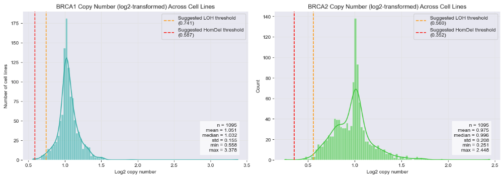

Based on the derived LOH and deep deletion flags, a singular BRCA-based HRD status was constructed. Other HRR genes were not explored in this study, but could be integrated in future iterations.

---

### 3c. HRD Feature Engineering: Proxy HRD Score (v1)

A genomic instability score was derived from available proxies of chromosomal damage (LOH, CIN, WGD, Aneuploidy). To transform this continuous score into a binary label, a two-component Gaussian Mixture Model (GMM) was fitted to the score distribution. The analytical intersection of the inferred components provided a data-driven threshold, defining HRD+ and HRD- subpopulations without reliance on arbitrary percentile cutoffs.

---

### 3d. HRD Feature Engineering: HRD Scores (external sources)

A composite HRD sum that integrates loss of heterozygosity (LOH), telomeric allelic imbalance (TAI), and large-scale state transtions (LST) was fetched externally to derive a canonical genomic scar-based HRD label. This was designed to be the second component for the final unified HRD score, with the proxy alternative available for unlabeled cell lines.

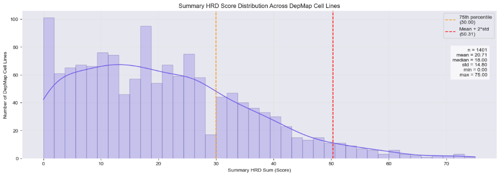

---

### 3e. HRD Feature Engineering: COSMIC Mutational Signatures

The **Catalogue Of Somatic Mutations In Cancer (COSMIC)** is a curated repository of somatic mutations across thousands of cancer genomes. COSMIC defines **mutational signatures**, which are reproducible patterns of nucleotide changes that reflect underlying biological processes, such as DNA repair deficiencies or exposure to specific mutagens. **Single Base Substitution (SBS) signatures** quantify the probability of a specific nucleotide change within a trinucleotide context. Specifically, **SBS3** is strongly associated with HRD. Leveraging externally-fetched SBS3 exposure values, non-zero SBS3 counts were flagged and used to generate the final HRD label used for this study.

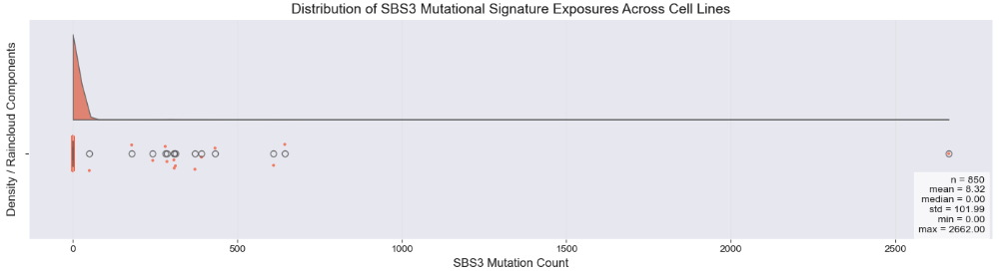

---

### 3f. HRD Feature Engineering: Unified HRD+ Label

A final binary feature was defined as the union of BRCA-driven, genomic scar–based, and SBS3 classifications, prioritizing sensitivity while preserving biological interpretability. (An alternate unified label was also created using the stricter std-based thresholds for each of the individual components. A more restrictive labeling did not change any results and therefore was dropped for the final modules.)

---

### 3g. Response Normalization Across Compounds

Because raw AUC distributions vary across compounds, response values were standardized within each drug to enable cross-drug comparability. Scaling was performing using median centered followed by division by the interquartile range (IQR), preserving rank structure while limiting the influence of outliers. Under this transformation, zero represents the typical response for a given drug, negative values denote relative sensitivity, and positive values indicate relative resistance.

---

### 3h. Statistical Evaluation of the HRD–PARPi Association

Finally, the relationship between HRD status and PARP inhibitor response was evaluated at multiple levels. Global comparisons assessed overall distributional differences across the aggregated inhibitors. Per-drug analyses quantified heterogeneity in both effect magnitude and statistical significance. Nonparametric methods were used to compare response distributions without imposing normality assumptions. Exploratory lineage-stratified visualizations were further used to probe potential tissue-level confounding.

Together, this multi-level framework provided a systematic assessment of the strength, direction, and consistency of HRD-associated differences in PARP inhibitor sensitivity across diverse DepMap cancer cell line models.

(<a href="#top">back to top</a>)

---
---
---

## 4. Key Findings

**(1) HRD landscape varies across DepMap cell line models.** 
HRD status varies by lineage, with ovarian, breast, and pancreatic models most frequently classified as HRD-positive. Both canonical (BRCA1/2-mutant, SBS3) and non-BRCA HRD-like cases were captured using the combined mutation and genomic scar framework. A closer look at HRD status across the primary four lineages is displayed below.

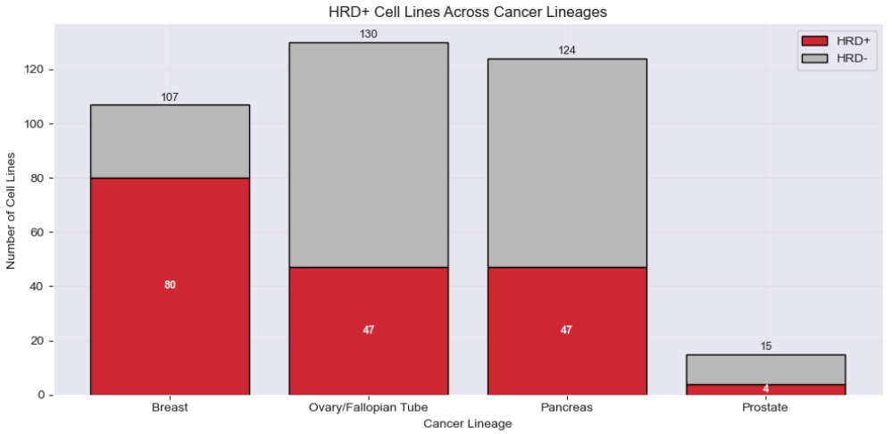

---

**(2) PARP inhibitors show heterogenous response profiles.** 
Drug response distributions differ substantially across compounds. Some agents (e.g., Talazoparib) demonstrate lower median AUC values, indicating stronger overall cytotoxicity, whereas others (e.g., Veliparib, S-111) show narrow, right-shifted distributions with limited variability. Several inhibitors (e.g., PJ-34) display wider dispersion or multimodal patterns, suggesting potential biological subgroups. A closer look at the clinically-approved PARP inhibitors is shown below.

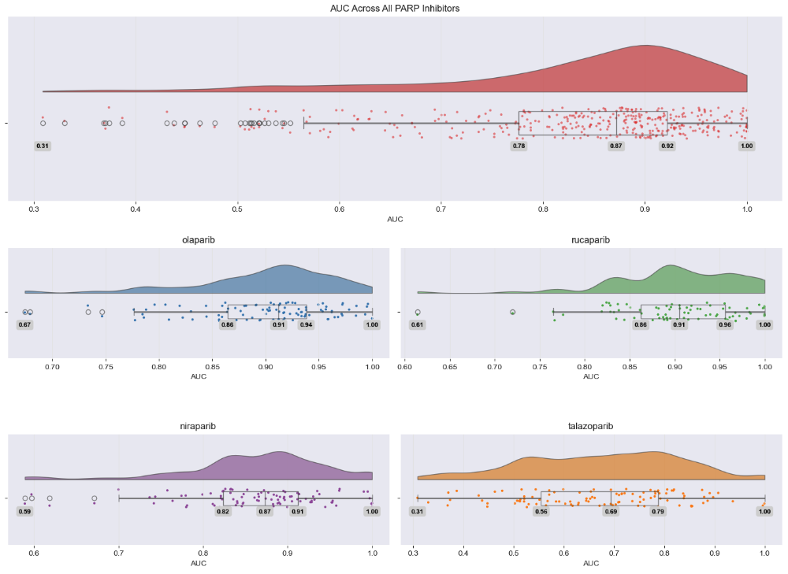

---

**(3) PARP inhibitors differ substantially in usable dynamic range.** 
Drug response variability is not uniform across compounds. Quantification of dispersion using the robust 95th–5th percentile range reveals marked differences in separability across models. Several agents (e.g., S-111, Veliparib, Iniparib) exhibit compressed distributions with minimal spread, limiting the ability to detect biological stratification. Others (e.g., AZD2461, E7449, PJ-34) demonstrate broader ranges and higher coefficients of variation, providing greater opportunity to observe phenotype–drug associations.

These properties are critical for interpretation: limited dynamic range can mask real biological effects, whereas wider distributions increase statistical sensitivity. Variation in downstream HRD results should therefore be interpreted in the context of each compound’s intrinsic measurement characteristics rather than assumed to reflect absence of biology.

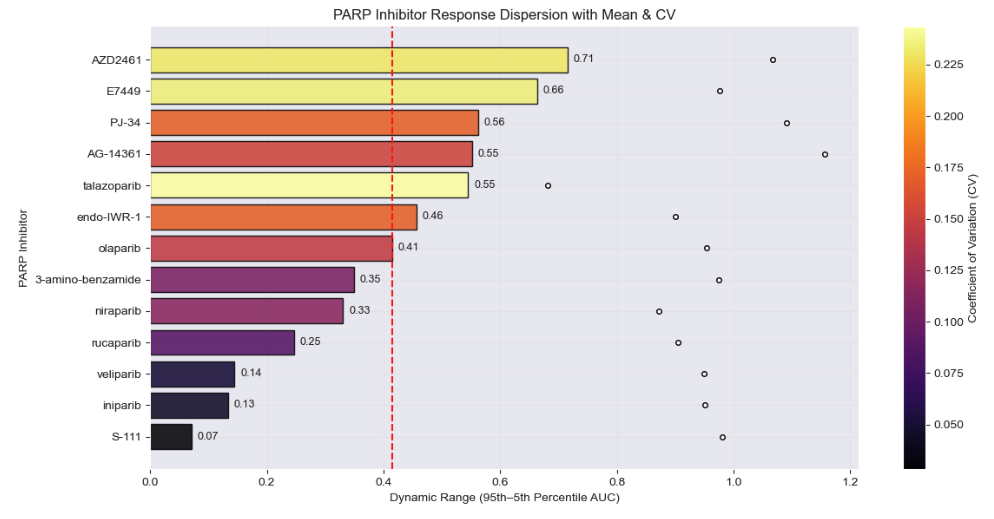

---

**(4) Although a global association between HRD status and PARPi response (AUC) was statistically detectable across some drug-cancer combinations, a focused study on the primary clinical indications and approved drugs did not show a clear difference across the *in vitro* cell lines.** 

The association between HRD status and drug response (AUC) varies by the PARPi compound. When evaluated within individual drugs, only a subset demonstrate significant HRD-linked differences (e.g., Olaparib, Niraparib, Endo-IWR-1). For many inhibitors, group medians are similar and hypothesis tests are not significant. This variability aligns with observed differences in dynamic range and response heterogeneity across compounds. However, looking closer at the primary four drugs across the approved indications showed no statistically significant associations when integrading multiple canonical HRD definitions.

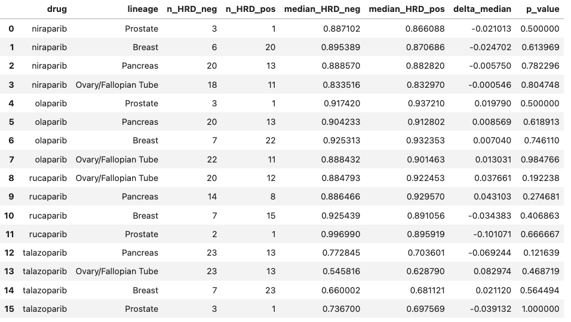

---

**(5) HRD status and drug response (AUC) varies by the tissue lineage (and even subtypes).** 

Although breaking down each lineage into subtypes did not materially alter the overall statistical significance of HRD effects, it revealed nuanced patterns in AUC differences between HRD+ and HRD− models. For most tumor types, the delta in median AUC remained small, indicating limited global shifts in sensitivity at the subtype level.

Interestingly, some subtypes exhibited deviations from the expected trend. For example, Invasive Breast Carcinoma showed a positive delta for Talazoparib (HRD+ median AUC > HRD− median AUC), suggesting that HRD+ cells in this subtype were slightly less sensitive than their HRD− counterparts. Other breast subtypes, and ovarian subtypes like High-Grade Serous Ovarian Cancer, displayed modest negative or near-zero deltas, reflecting minor increases in sensitivity or negligible differences.

These observations indicate that while HRD status broadly informs PARP inhibitor response, the effect can be context-dependent at the subtype level, highlighting the value of stratifying by finer histological resolution when exploring lineage-specific vulnerabilities. The heatmap emphasizes that subtypes within the same primary lineage may differ subtly in HRD-associated drug response, even when the overall lineage effect is minimal.

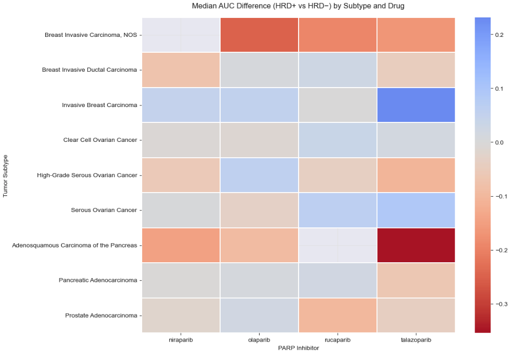

---

**(6) Drug identity and tissue lineage explain more variance than HRD alone.** 
Regression models incorporating drug and tissue lineage account for substantially more variability in AUC than HRD status alone. After adjustment, the HRD coefficient attenuates and loses statistical significance, suggesting that baseline pharmacologic differences and lineage structure contribute strongly to observed response patterns.

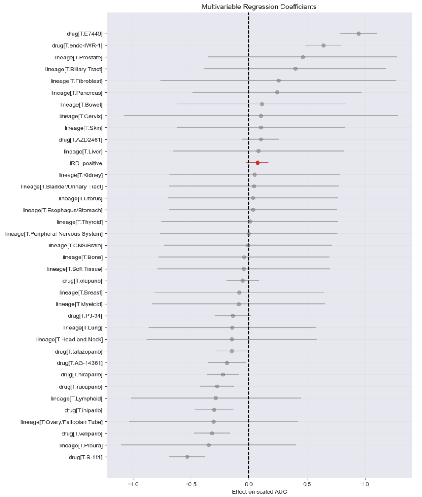

Collectively, these results indicate that HRD doesn't reliably capture PARP inhibitor response across DepMap models. Sensitivity likely reflects additional determinants, including lineage context, alternative DNA repair mechanisms, and compound-specific pharmacologic properties.

(<a href="#top">back to top</a>)

---
---
---

### Conclusions

This project developed an integrated framework linking homologous recombination deficiency (HRD) features with PRISM-derived pharmacologic response across a large panel of cancer cell lines. BRCA mutations, genomic scar–based scores, and SBS3 exposure values were integrated to construct a biologically-grounded HRD classification and to systematically evaluate its association with sensitivity to multiple PARP inhibitors.

In pooled analyses (v1), HRD-positive models exhibited statistically detectable differences in response with modest effect size. However, this did not translate to a curated cohort that studied the four primary drugs across the main indications, especially when restricted to canonical HRD labeling in lieu of the proxy derivations. When examined at the individual drug level, only a subset demonstrated noticeable, but statistically insignificant HRD-related separation. These associations further attenuated after adjustment for compound and tissue lineage in multivariable models. Collectively, these findings suggest that HRD status alone provides limited predictive power for PARP inhibitor sensitivity across heterogeneous *in vitro* cancer models. The results also highlight that statistically significant differences do not always translate into meaningful predictive performance.

Future work should explore more nuanced representations of DNA repair dysfunction, integrate additional molecular covariates, and explicitly model interaction effects that may better explain context-specific therapeutic response. In particular, replacing the threshold-based HRD engineering with established labels validated by the scientific community across DepMap's cell lines would strengthen biological interpretability, improve cross-study comparability, and reduce reliance on dataset-specific thresholding strategies. As outlined in the [original study](https://pmc.ncbi.nlm.nih.gov/articles/PMC10847511/), there could be external factors that are contributing to the discrepancy between the clinical and cell culture results. The lack of a strong association may reflect confounding by drug potency, differential lineage susceptibility, or incomplete capture of functional HRD beyond genomic annotations. Nonetheless, this baseline study establishes a foundation for lineage and drug-aware evaluation of PARP inhibitor sensitivity and shows the importance of multivariable modeling when interpreting biomarker effects.

(<a href="#top">back to top</a>)

<!-- MARKDOWN LINKS & IMAGES -->
[issues-shield]: https://img.shields.io/github/issues/rc-9/DepMap_HRD_PARPi.svg?style=for-the-badge
[issues-url]: https://github.com/rc-9/DepMap_HRD_PARPi/issues
