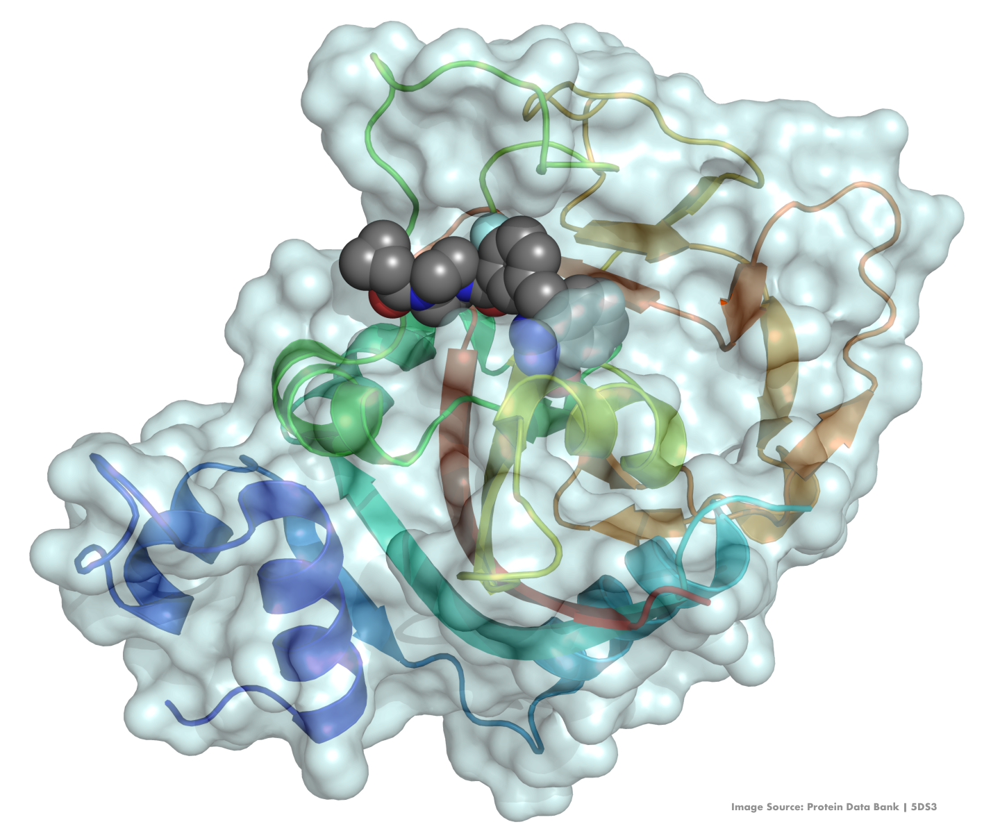

[![Issues][issues-shield]][issues-url]



<!--  -->
<!-- <p style="font-size:0.8em; color:gray; margin-top:-10px; text-align:right;">
<em>Image Source: Protein Data Bank | 5DS3</em>
</p> --> 
<!-- <p align="right"><em>Image Source: Protein Data Bank | 5DS3</em></p> -->


<h2 align="center">Integrative Analysis of HRD and PARPi Drug Response</h2>
<!-- <h1 align="center">HRD Profiling & PARP Inhibitor Response</h1> -->
<h5 align="center">A functional genomics framework for classifying homologous recombination deficiency<br> and mapping PARP inhibitor sensitivity across DepMap cancer cell lines.</h5>
  <p align="center">
    <br />
    <a href="https://github.com/rc-9/DepMap_HRD_PARPi/issues">Report Bug</a>
    ·
    <a href="https://github.com/rc-9/DepMap_HRD_PARPi/issues">Request Feature</a>
  </p>
</div>


<!-- TABLE OF CONTENTS -->
<details>
  <summary>Table of Contents</summary>
  <ol>
    <li><a href="#background">Background</a></li>
    <li><a href="#research-question">Research Question</a></li>
    <li><a href="#methodology">Methodology</a></li>
    <li><a href="#key-findings">Key Findings</a></li>
    <li><a href="#conclusions">Conclusions</a></li>
    <li><a href="#usage">Usage</a></li>
  </ol>
</details>


## Project Overview


### Background

Cancer arises from the accumulation of genetic and epigenetic alterations that disrupt normal cellular growth and DNA repair mechanisms. A central mechanism for maintaining genomic integrity is homologous recombination (**HR**), a high-fidelity pathway that repairs DNA double-strand breaks using an intact sister chromatid as a template. Deficiencies in this process, collectively termed as homologous recombination deficiency (**HRD**), can result from mutations in key genes such as BRCA1/2, epigenetic silencing, or other genomic alterations, ultimately leading to genomic instability.

HRD is clinically significant because it creates therapeutically exploitable vulnerabilities. Poly(ADP-ribose) polymerase (**PARP**) is an enzyme that facilitates repair of single-strand DNA lesions. If these lesions persist into DNA replication, replication fork collapse can generate double-strand breaks. In HRD cells, these breaks cannot be accurately repaired. Therefore, pharmacologic inhibition of PARP induces synthetic lethality: the combined loss of HR function and PARP-mediated repair overwhelms DNA repair capacity, leading to accumulation of DNA damage and selective cancer cell death.


On this basis, PARP inhibitors (PARPi) are approved across multiple malignancies enriched for HRD, particularly those harboring BRCA mutations. Linking HRD-associated molecular features with drug response provides a framework for identifying therapeutic vulnerabilities and advancing precision oncology.

Despite this mechanistic rationale and clinical success, whether large-scale preclinical cell line models consistently recapitulate the expected HRD–PARPi sensitivity relationship remains uncertain. A recent [study](https://pmc.ncbi.nlm.nih.gov/articles/PMC10847511/) of large cancer cell line collections reported that HRD status does not uniformly associate with increased sensitivity to PARP inhibitors or platinum agents in standard 2D cell culture assays. In some contexts, higher HRD scores and mutational signature patterns were even associated with relative resistance. These observations raise important questions regarding the translational fidelity of widely used in vitro models and underscore the need for careful interpretation when extrapolating preclinical biomarker associations to clinical settings.

<p align="right">(<a href="#top">back to top</a>)</p>

### Research Question

The purpose of this project is to systematically explore DepMap cancer cell lines, identify models screened with PARP inhibitors, construct biologically-grounded HRD classifications, and answer the following question:

---

**Under established HRD frameworks, what quantitative relationship exists between HRD status and PARP inhibitor response across DepMap cancer cell lines?**

---

<p align="right">(<a href="#top">back to top</a>)</p>

#### Methodology


<p align="right">(<a href="#top">back to top</a>)</p>


#### Key Findings


<p align="right">(<a href="#top">back to top</a>)</p>


#### Conclusions


<p align="right">(<a href="#top">back to top</a>)</p>


# Usage

- ```hrd_feature_engineering.ipynb```: 

- ```parpi_response_analysis.ipynb```:


<p align="right">(<a href="#top">back to top</a>)</p>


<!-- MARKDOWN LINKS & IMAGES -->
[issues-shield]: https://img.shields.io/github/issues/rc-9/DepMap_HRD_PARPi.svg?style=for-the-badge
[issues-url]: https://github.com/rc-9/DepMap_HRD_PARPi/issues
