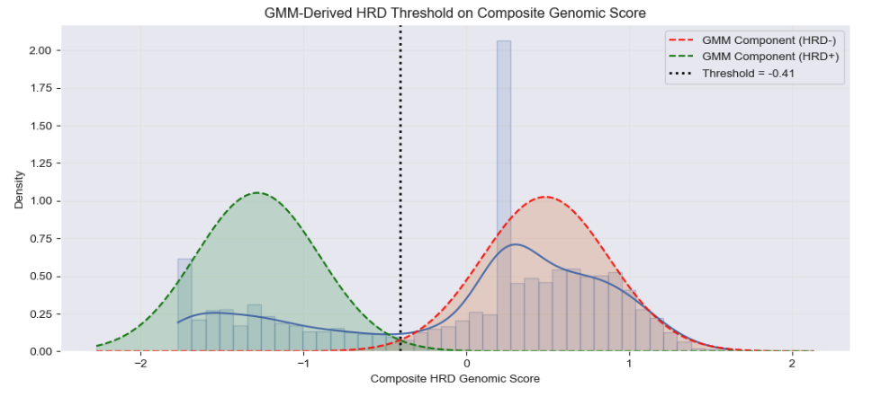

[![Issues][issues-shield]][issues-url]

<!--  -->
<!-- 

<em>Image Source: Protein Data Bank | 5DS3</em>

 --> 
<!-- 
<em>Image Source: Protein Data Bank | 5DS3</em>
 -->

<h2 align="center">Integrative Analysis of HRD and PARPi Drug Response</h2>
<!-- <h1 align="center">HRD Profiling & PARP Inhibitor Response</h1> -->
<h5 align="center">A functional genomics framework for classifying homologous recombination deficiency  and mapping PARP inhibitor sensitivity across DepMap cancer cell lines.</h5>
  

     
    <a href="https://github.com/rc-9/DepMap_HRD_PARPi/issues">Report Bug</a>
    ·
    <a href="https://github.com/rc-9/DepMap_HRD_PARPi/issues">Request Feature</a>
  

<!-- TABLE OF CONTENTS -->

  
Table of Contents

  <ol>
    <li><a href="#background">Background</a></li>
    <li><a href="#research-question">Research Question</a></li>
    <li><a href="#methodology">Methodology</a></li>
    <li><a href="#key-findings">Key Findings</a></li>
    <li><a href="#conclusions">Conclusions</a></li>
    <li><a href="#usage">Usage</a></li>
  </ol>

## Project Overview

### Background

Cancer arises from the accumulation of genetic and epigenetic alterations that disrupt normal cellular growth and DNA repair mechanisms. A central mechanism for maintaining genomic integrity is homologous recombination (**HR**), a high-fidelity pathway that repairs DNA double-strand breaks using an intact sister chromatid as a template. Deficiencies in this process, collectively termed as homologous recombination deficiency (**HRD**), can result from mutations in key genes such as BRCA1/2, epigenetic silencing, or other genomic alterations, ultimately leading to genomic instability.

HRD is clinically significant because it creates therapeutically exploitable vulnerabilities. Poly(ADP-ribose) polymerase (**PARP**) is an enzyme that facilitates repair of single-strand DNA lesions. If these lesions persist into DNA replication, replication fork collapse can generate double-strand breaks. In HRD cells, these breaks cannot be accurately repaired. Therefore, pharmacologic inhibition of PARP induces synthetic lethality: the combined loss of HR function and PARP-mediated repair overwhelms DNA repair capacity, leading to accumulation of DNA damage and selective cancer cell death.

On this basis, PARP inhibitors (PARPi) are approved across multiple malignancies enriched for HRD, particularly those harboring BRCA mutations. Linking HRD-associated molecular features with drug response provides a framework for identifying therapeutic vulnerabilities and advancing precision oncology.

Despite this mechanistic rationale and clinical success, whether large-scale preclinical cell line models consistently recapitulate the expected HRD–PARPi sensitivity relationship remains uncertain. A recent [study](https://pmc.ncbi.nlm.nih.gov/articles/PMC10847511/) of large cancer cell line collections reported that HRD status does not uniformly associate with increased sensitivity to PARP inhibitors or platinum agents in standard 2D cell culture assays. In some contexts, higher HRD scores and mutational signature patterns were even associated with relative resistance. These observations raise important questions regarding the translational fidelity of widely used in vitro models and underscore the need for careful interpretation when extrapolating preclinical biomarker associations to clinical settings.

(<a href="#top">back to top</a>)

### Research Question

The purpose of this project is to systematically explore DepMap cancer cell lines, identify models screened with PARP inhibitors, construct biologically-grounded HRD classifications, and answer the following question:

---

**Under established HRD frameworks, what quantitative relationship exists between HRD status and PARP inhibitor response across DepMap cancer cell lines?**

---

(<a href="#top">back to top</a>)

### Methodology

This project was conducted in multiple phases:

- `hrd_feature_engineering.ipynb` walks through data acquisition, harmonization, and feature engineering steps used to construct a unified HRD status for each cell line.

- `parpi_response_analysis.ipynb` builds on the processed dataset to explore PARP inhibitor response patterns and quantitatively evaluate the association between HRD status and drug sensitivity.

A detailed overview of each section is outlined below.

#### Data Acquisition and Harmonization

The following datasets were extracted from [DepMap](https://depmap.org/portal/data_page/?tab=allData):
- Cancer Cell Line Model Metadata
- Drug Response Data (PRISM Secondary Screens)
- Omics Somatic Mutations Matrix (Damaging Variants)
- Omics Global Signatures (LOH, CIN, WGD, Aneuploidy)

All datasets were harmonized using the DepMap `ModelID` to ensure cross-release compatibility. The analysis cohort was defined by selecting cell lines screened with PARP inhibitors and merging with corresponding metadata. For PRISM drug screens with replicates (from multiple wells or experimental runs), median AUC was used to collapse values per model-drug pair. Additional data validation steps were also performed to confirm data quality and structural integrity.

#### HRD Feature Engineering

HRD status was defined using complementary, biologically informed frameworks.

BRCA-driven HRD: 
Cell lines harboring damaging alterations in BRCA1 or BRCA2 were classified as HRD+ under a canonical mutation-based definition.

Genomic scar–based HRD: 
A composite genomic instability score was derived from available proxies of chromosomal damage. To transform this continuous score into a binary label, a two-component Gaussian Mixture Model (GMM) was fitted to the score distribution. The analytical intersection of the inferred components provided a data-driven threshold, defining HRD+ and HRD- subpopulations without reliance on arbitrary percentile cutoffs.

Unified HRD definition: 
A final binary feature (`HRD_positive`) was defined as the union of BRCA-driven and genomic scar–based classifications, prioritizing sensitivity while preserving biological interpretability.

The engineered HRD features were merged with PARP inhibitor response data to generate an analysis-ready dataset of 731 unique cell line models across 13 PARPi drugs.

#### Response Normalization Across Compounds

Because raw AUC distributions vary across compounds, response values were standardized within each drug to enable cross-drug comparability. Scaling was performing using median centered followed by division by the interquartile range (IQR), preserving rank structure while limiting the influence of outliers. Under this transformation, zero represents the typical response for a given drug, negative values denote relative sensitivity, and positive values indicate relative resistance.

#### Statistical Evaluation of the HRD–PARPi Association

The relationship between HRD status and PARP inhibitor response was evaluated at multiple levels. Global comparisons assessed overall distributional differences across the aggregated inhibitors. Per-drug analyses quantified heterogeneity in both effect magnitude and statistical significance. Nonparametric methods were used to compare response distributions without imposing normality assumptions. Exploratory lineage-stratified visualizations were further used to probe potential tissue-level confounding.

Together, this multi-level framework provided a systematic assessment of the strength, direction, and consistency of HRD-associated differences in PARP inhibitor sensitivity across diverse DepMap cancer cell line models.

(<a href="#top">back to top</a>)

### Key Findings

**HRD Landscape Across Cell Lines**: 
HRD status varies by lineage, with ovarian, breast, and pancreatic models most frequently HRD-positive. Canonical and atypical HRD cases were captured using combined BRCA1/2 mutations, HR pathway alterations, and genomic scar metrics.

<!--  -->

**PARP Inhibitor Response Patterns**: 
Drug sensitivity across 13 PARPi shows lineage-specific trends for some agents (e.g., olaparib, talazoparib), but overall responses are heterogeneous. Standard 2D assays do not consistently reproduce expected clinical HRD–PARPi sensitivity.

**HRD vs PARPi Sensitivity**: 
Although the results varied across the different PARPi drugs, correlation analyses revealed that canonical HRD markers, including BRCA1/2 mutations and genomic scar–based HRD scores, did not consistently predict PARP inhibitor sensitivity in vitro.

(<a href="#top">back to top</a>)

### Conclusions

(<a href="#top">back to top</a>)

<!-- MARKDOWN LINKS & IMAGES -->
[issues-shield]: https://img.shields.io/github/issues/rc-9/DepMap_HRD_PARPi.svg?style=for-the-badge
[issues-url]: https://github.com/rc-9/DepMap_HRD_PARPi/issues
